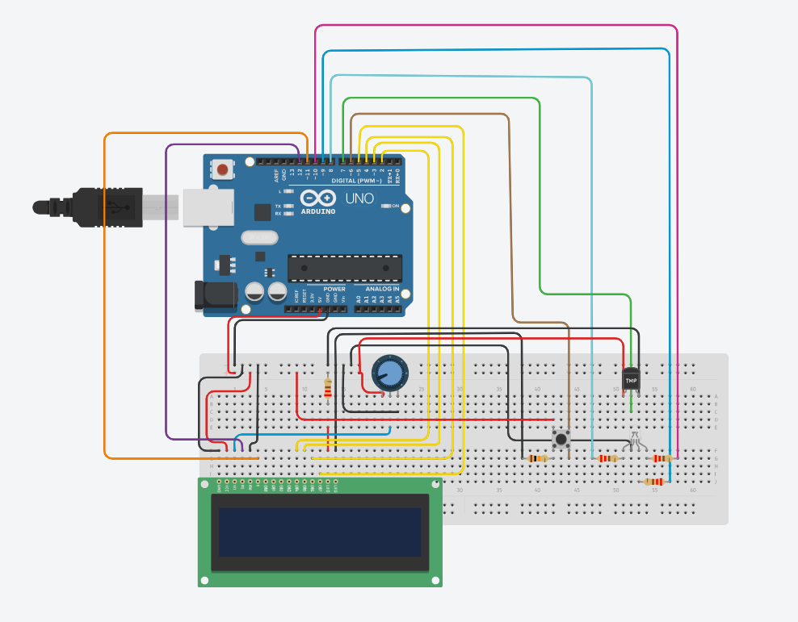
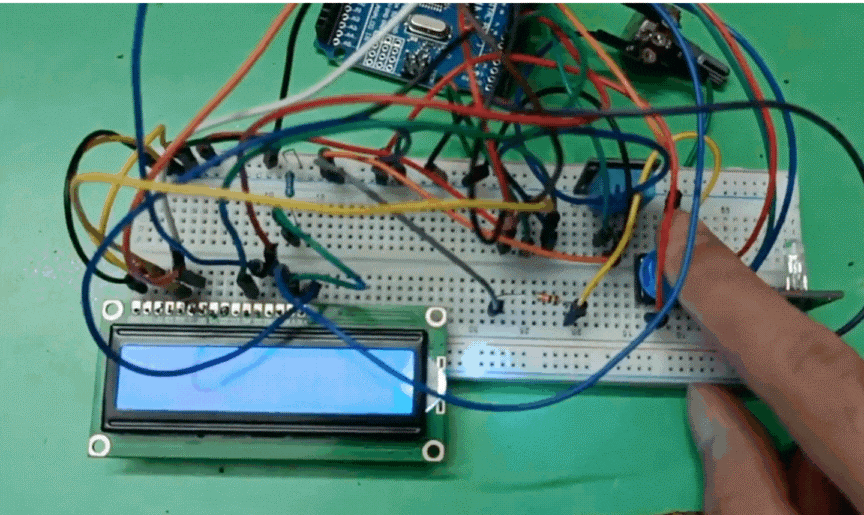

# LCD Climate Monitor with DHT11 Sensor 🌡️

This project demonstrates a **Climate Monitor** system using an **Arduino Uno**, a **DHT11 temperature & humidity sensor**, an **LCD display**, and **LED indicators**. The system allows you to monitor the humidity and temperature when a button is pressed. Based on the readings, it changes the LED colors to indicate different climate conditions.

---

## Table of Contents 📑
- [Project Overview](#project-overview)
- [Features](#features)
- [Hardware Components](#hardware-components)
- [Wiring Diagram](#wiring-diagram)
- [How It Works](#how-it-works)
- [Code](#code)
- [Installation](#installation)
- [Future Improvements](#future-improvements)

---

## Project Overview 💡

This project collects temperature and humidity data from a **DHT11 sensor** and displays the data on a **16x2 LCD screen**. The system is activated by a **pushbutton**, and LEDs change color based on the climate conditions:
- **Red LED** indicates high temperature or humidity.
- **Green LED** indicates normal temperature and humidity.
- **Blue LED** indicates moderate conditions.

### Main Functions:
1. Press the button to read and display temperature & humidity.
2. LEDs light up based on the conditions:
   - **High temperature/humidity**: Red LED.
   - **Moderate**: Blue LED.
   - **Normal**: Green LED.

---

## Features ✨

- **Real-time climate monitoring**: Read and display humidity & temperature.
- **LED indicators**: Visual representation of different climate conditions.
- **Interactive**: Data reading triggered by a pushbutton.
- **LCD display**: Shows humidity and temperature readings.

---

## Hardware Components 🔌

1. **Arduino Uno** – Main microcontroller board.
2. **DHT11 Sensor** – Measures temperature and humidity.
3. **16x2 LCD Display** – Displays temperature and humidity readings.
4. **Pushbutton** – Activates the system.
5. **3 LEDs (Red, Green, Blue)** – Indicate different climate conditions.
6. **Resistors** – For LED protection.
7. **Breadboard and Jumper Wires** – For easy circuit connections.

### Pin Connections:

- **DHT11 Sensor**: 
  - Data pin to **Pin 6** on Arduino.
- **LCD Display**:
  - RS → Pin 12
  - EN → Pin 11
  - D4 → Pin 2
  - D5 → Pin 3
  - D6 → Pin 4
  - D7 → Pin 5
- **Pushbutton**: Connected to **Pin 7**.
- **LEDs**:
  - Red LED → Pin 8
  - Green LED → Pin 9
  - Blue LED → Pin 10

---

## Wiring Diagram 🛠️



---

## Visual Representation



## How It Works 🔍

1. **Pushbutton Activation**: When the button is pressed, the system reads data from the **DHT11 sensor**.
2. **Display Data**: The humidity and temperature readings are displayed on the **LCD screen**.
3. **LED Indicators**:
   - If humidity is **≥ 70%** or temperature **≥ 30°C**, the **red LED** turns on (indicating extreme conditions).
   - If humidity is **between 40% and 70%** or temperature **between 25°C and 30°C**, the **blue LED** turns on (indicating moderate conditions).
   - If humidity is **< 40%** or temperature **< 25°C**, the **green LED** turns on (indicating normal conditions).

---

## Code 🖥️

The full code for this project can be found in the [main.ino](main.ino) file. Below is a quick overview of the key functions:

- **`lcd_printing()`**: Displays the temperature and humidity on the LCD.
- **`printing()`**: Prints the data to the Serial Monitor.
- **Button-controlled loop**: Reads data when the button is pressed, otherwise, the system remains idle.
- **LED control logic**: Turns LEDs on based on the current humidity and temperature values.

---

## Installation ⚙️

1. **Clone this repository**:
   ```bash
   git clone https://github.com/MahrufHossain/Arduino_UNO_Projects.git
## Open the project in Arduino IDE:

 - Open lcd_climate_monitor.ino in the Arduino IDE.

## Install Required Libraries: Make sure to install the following libraries:

 - DHT Sensor Library by Adafruit
 - Adafruit Unified Sensor
 - LiquidCrystal Library

## Upload the Code:

Select your Arduino board (Tools > Board > Arduino Uno).
Select the correct port (Tools > Port).
Click Upload to flash the code onto your Arduino.

## Future Improvements 🚀
 - Add a buzzer for high temperature/humidity warnings.
 - Implement data logging to track temperature and humidity over time.
 - Use an I2C interface for the LCD to reduce pin usage.

## License 📄
This project is licensed under the GNU License. Feel free to use, modify, and share!

## Contact 📧
 - GitHub: [MahrufHossain](https://github.com/MahrufHossain)
 - Email: mahrufhossain97@gmail.com
